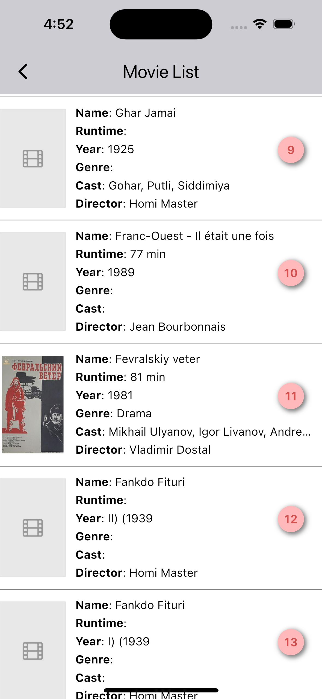

# Movies-list

# Movies-list

**Movies-list** is a movies list application


## Getting Started

1. **Clone the Repository:**

   ```bash
   git clone https://github.com/yourusername/digidastavej.git


|  |  |
|------------------------------------------|------------------------------------------------------------|
|
## Prerequisites

- Flutter SDK
- Android Studio or Xcode


## Additional Resources

If you're new to Flutter development, here are some resources to get you started:

- [Lab: Write your first Flutter app](https://docs.flutter.dev/get-started/codelab)
- [Cookbook: Useful Flutter samples](https://docs.flutter.dev/cookbook)

For comprehensive guidance on Flutter development, check out the [online documentation](https://docs.flutter.dev/). It provides tutorials, samples, guidance on mobile development, and a full API reference.

## Contributing

We welcome contributions to improve DigiDastavej! If you'd like to contribute, please follow these steps:

1. Fork the repository
2. Create a new branch for your feature or bug fix
3. Make your changes and commit them with clear, descriptive messages
4. Push your changes to your fork
5. Submit a pull request to the main repository

For major changes or new features, please open an issue first to discuss what you would like to change.

Please make sure to update tests as appropriate and adhere to the project's coding standards.

#### Made with ❤ by [@nittinsharma37](https://github.com/nittinsharma37)

## License

This project is licensed under the MIT License. See the [LICENSE](LICENSE) file for full details.

The MIT License is a permissive license that allows for reuse of the software with minimal restrictions. It permits use, modification, and distribution of the code for both private and commercial purposes, as long as the original copyright and license notice are included.

